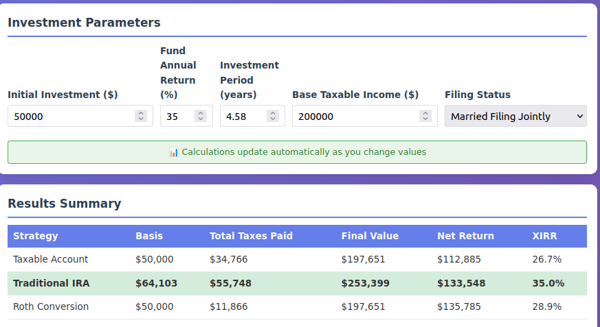
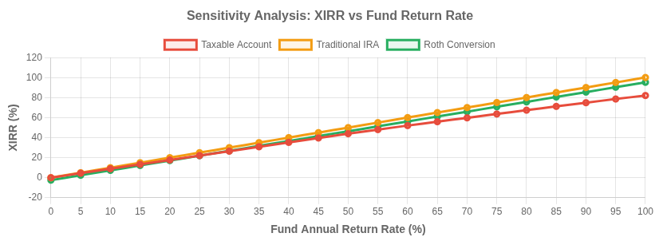

# Investment Strategy Calculator

## Summary

The Investment Strategy Calculator compares after-tax, cash-to-cash returns for three investment strategies — **Taxable Account**, **Traditional IRA**, and **Roth Conversion IRA** — over the life of a private fund. It uses the Extended Internal Rate of Return (XIRR) to quantify post-tax equivalent cash flows from an initial investment to terminal liquidation. This approach ensures apples-to-apples comparison of three different investment vehicles and highlights how tax treatment impacts net outcomes.

---

## Methodology

The tool uses annual compounding to model fund growth and applies U.S. federal tax rules to simulate after-tax returns for each strategy. Progressive tax rates are applied based on the incremental income yielded by the fund, as applicable. XIRR is computed using all actual cash flows (inflows and outflows), producing a metric that reflects comparable post-tax net return to the investor. Each strategy is evaluated over the fund's life with a single terminal liquidation, allowing direct comparability across tax treatments.

---

## Key Assumptions

- Tax Year: 2025 progressive tax brackets and rules apply for all years. Future tax policy is assumed unchanged.
- Fund returns are net of fees, but before taxes.
- **Taxable Account**: Gains taxed annually as ordinary income, with taxes paid from external funds.
- **Roth IRA**: Conversion from a Traditional IRA, which contributes to income and could result in a higher marginal tax, paid upfront from external funds; growth and withdrawals are tax-free.
- **Traditional IRA**: Contributions are grossed-up to pre-tax equivalence using the current marginal tax rate; terminal value taxed as a full lump sum for comparability, but taxed modestly at the current marginal tax rate as governed by the Base Taxable Income value. This taxation assumes distributions occur over a long period of time and do not cause an increase in the marginal tax rate.

---

## Nominal Example Calculations

### Inputs

- Initial Investment: $50,000 post-tax (or equivalent)
- Fund Annual Return: 35%
- Investment Period: 4.58 years (6/1/2025 through 12/31/2029)
- Base Taxable Income: $200,000
- Filing Status: Married Filing Jointly

---

### Strategy 1: Taxable Account

**Structure:**
- Starting investment: $50,000
- Growth mechanism: 35% annual return on prior year basis
- Tax treatment: Annual gains taxed as ordinary income at marginal rates

**Results:**
- Final Value: $197,651
- Total Taxes Paid: $34,766
- Net Return: $112,885
- XIRR: 26.7% (~8pp tax drag from fund return)

---

### Strategy 2: Traditional IRA

**Structure:**
- Pre-tax equivalent investment: $64,103
- Marginal tax rate assumption: 22%
- Growth mechanism: Tax-deferred compounding at 35% annually

**Results:**
- Pre-Tax Final Value: $253,399
- Tax on Withdrawal: $55,748
- After-Tax Final Value: $197,651
- Net Return: $133,548
- XIRR: 35.0% (matches fund return due to tax deferral)

---

### Strategy 3: Roth Conversion IRA

**Structure:**
- Roth conversion amount: $50,000
- Upfront conversion tax: $11,866 (effective rate 23.7%)
- Growth mechanism: Tax-free compounding at 35% annually

**Results:**
- Final Value: $197,651
- Total Taxes Paid: $11,866 (conversion tax only)
- Net Return: $135,785
- XIRR: 28.9%

---

## Sensitivity Analysis

The tool includes a sensitivity analysis feature that illustrates how changes in the fund's annual return rate (e.g., 0% to 100%) impact the XIRR for each strategy. This analysis helps investors understand how strategy performance shifts as a function of fund return. The curve trajectories clarify crossover points where one strategy begins to outperform another depending on return magnitude.

---

## Strategic Implications

This tool shows that strategy effectiveness varies across the fund return spectrum:

- **Traditional IRA** consistently outperforms across all return levels due to its grossed-up basis advantage. This higher basis allows more capital to compound tax-deferred, creating a mathematical advantage that persists even after paying withdrawal taxes at the same marginal rate.
- **Roth IRA** ranks second in performance across most scenarios.
- **Taxable accounts** rank third due to annual tax drag reducing compounding benefits.

---

## Important Considerations

**Future Tax Rate Risk to Traditional IRAs**: Given the continued fiscal deficits and mounting inflation, it’s quite possible that future tax rates will be higher than today. Roth IRAs provide significant protection against future tax rate increases. However, a taxable account also provides some protection because the basis is reset each year through annual tax payments, limiting exposure to future rate changes.

**Estate Planning Implications**: Do you anticipate passing on these funds? If so, a Roth is a far better choice because:
- Taxable accounts and Roth IRAs pass to heirs with zero tax consequences
- Traditional IRAs are fully taxable to heirs at ordinary income rates
- Traditional IRAs are the worst inheritance option

**Scale and Time Horizon Effects**: The investment amount makes little difference on the relative performance of the strategies, ignoring SDIRA administrative costs. The ranking remains: Traditional, then Roth, then Taxable. The same also applies to investment horizon---extending this analysis to 20 years results in the same relative ranking. However, as more time passes, the initial tax cash outlay for the Roth starts to get amortized over more years, narrowing the gap in performance between the Traditional IRA and Roth.

**Base Taxable Income**: As based income rises, the IRA benefits are magnified, but the relative ranking remains the same.

---

## Conclusion

Under current tax law assumptions, Traditional IRAs provide the highest mathematical returns, but Roth IRAs offer superior protection against future tax increases and estate planning advantages. The optimal choice depends on your expectations about future tax policy and inheritance planning goals.

---

## Disclaimer

This calculator is provided for educational and informational purposes only and does not constitute investment, tax, or financial advice. All calculations are estimates and may not reflect actual results. Investment decisions should be made in consultation with qualified financial and tax professionals. Tax laws are complex and subject to change. By using this calculator, you acknowledge that the results are for illustrative purposes only and agree to hold harmless the creators from any decisions made based on these calculations. You assume full responsibility for any investment decisions and their outcomes.
